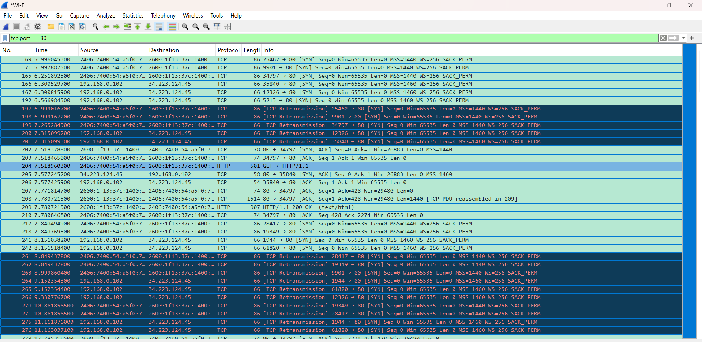
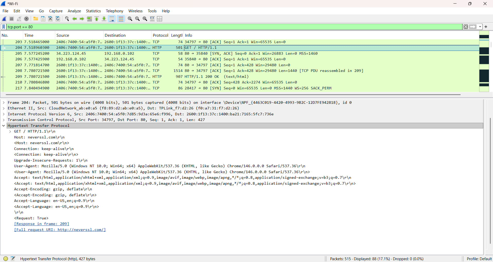

# Packet Capture Analysis — Day 1

## Filter Used
tcp.port == 80

---

## 1. TCP Handshake

### Observed Flow

[SYN] → Client initiates connection  
[SYN, ACK] → Server acknowledges  
[ACK] → Connection established  

### Evidence

### Observations
- Multiple SYN packets sent before successful connection  
- Repeated `[TCP Retransmission]` events  
- Delayed SYN-ACK responses  

### Analysis
- Indicates packet loss or delayed responses during connection setup  
- TCP retransmits packets when acknowledgments are not received  
- Demonstrates reliability mechanisms built into TCP  

---

## 2. TLS Handshake (HTTPS Traffic)

### Observed

- Client Hello (SNI present)
- Server Hello  
- Certificate exchange  
- Encrypted Application Data  

### Key Insight

After the TLS handshake:
→ All application-layer data is encrypted  

Example:

TLSv1.3 Application Data (Unreadable)

### Analysis
- TLS creates a secure channel over TCP  
- Prevents visibility into HTTP requests and responses  
- Requires interception (e.g., proxy with certificates) to inspect  

---

## 3. HTTP Traffic (Port 80)

### Evidence

### Observed

GET / HTTP/1.1
Host: neverssl.com

Response:

HTTP/1.1 200 OK

### Observations
- Full HTTP request visible in packet capture  
- Headers (Host, User-Agent, Accept) exposed  
- Server response clearly readable  

### Analysis
- Traffic is transmitted in cleartext  
- No encryption or protection of data  
- Easily inspectable and modifiable  

---

## 4. HTTP vs HTTPS Comparison

| Feature        | HTTP (80) | HTTPS (443) |
|----------------|----------|------------|
| Visibility     | Full     | Encrypted  |
| Headers        | Visible  | Hidden     |
| Payload        | Visible  | Hidden     |
| Security       | None     | Strong     |

---

## 5. Retransmissions

### Observed

Multiple:

[TCP Retransmission] SYN

### Analysis
- Packet loss or delayed acknowledgments  
- Network instability or latency  
- TCP retries ensure eventual delivery  

---

## 6. Connection Lifecycle

- SYN → SYN-ACK → ACK (Handshake)  
- Data transfer (HTTP or TLS)  
- FIN / ACK (Graceful termination)  

---

## 7. Connection Flow Insight

Multiple retransmissions occurred before a successful TCP handshake.  
Once established, HTTP traffic was transmitted and a valid response was received.

---

## Final Mental Model

Browser Request Flow:

Browser → TCP → TLS → HTTP → Server → Response → Render

---

## Security Insight

Encryption protects data **in transit**, but NOT:

- Endpoints (client/server compromise)  
- Application logic vulnerabilities  
- Misconfigurations  

---

## Key Takeaway

- TCP ensures reliability through retransmissions  
- TLS ensures confidentiality through encryption  
- HTTP exposes all data when used without TLS  

Understanding this boundary is critical for both:
- Offensive security (interception, manipulation)
- Defensive security (encryption, hardening)
