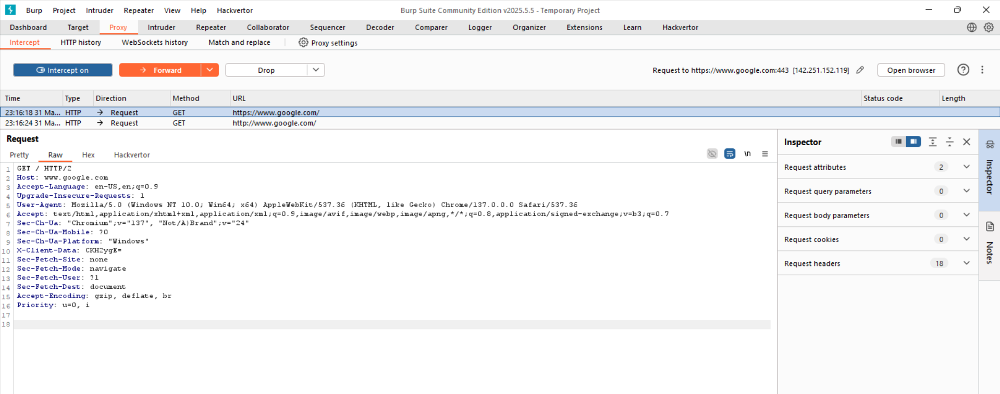
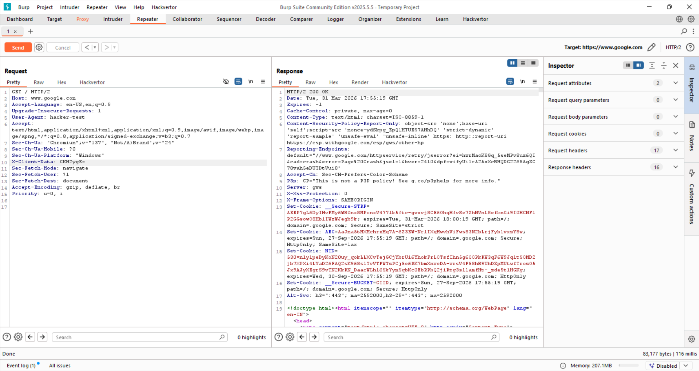

# Day 2 — Understanding HTTP Requests

## Objective
Break down HTTP requests and understand how browsers communicate with servers.

---

## What I Did

- Intercepted live traffic using Burp Suite
- Analyzed raw HTTP requests
- Observed server responses
- Identified key headers and their roles
- Experimented with modifying requests

---

## Key Learning

An HTTP request is made up of:

- Method (GET / POST)
- Path (/)
- Protocol (HTTP/1.1 or HTTP/2)
- Headers (Host, User-Agent, etc.)
- Body (optional)

---

## Evidence

### HTTP History View

---

### Raw Request Captured

---

### Server Rejecting Request (400 Bad Request)

---

### Successful Request via Repeater

---

### Header Modification (User-Agent)

---

### Host Header Manipulation

---

## Key Insight

> The server does not trust the browser — it trusts the HTTP request.

If you control the request → you control how the server behaves.

---

## Skills Built

- Reading raw HTTP requests
- Understanding headers and their purpose
- Observing server responses
- Identifying request structure
- Basic request manipulation

---

## Next Step

Move from understanding requests → actively sending and manipulating them (Day 3).
