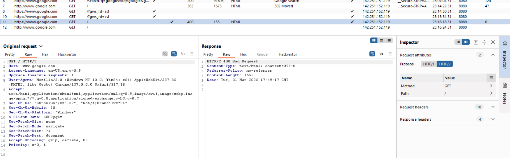
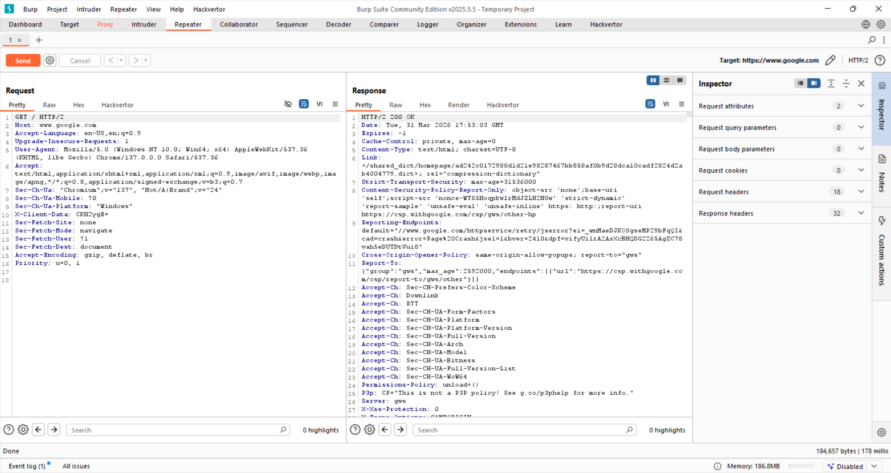
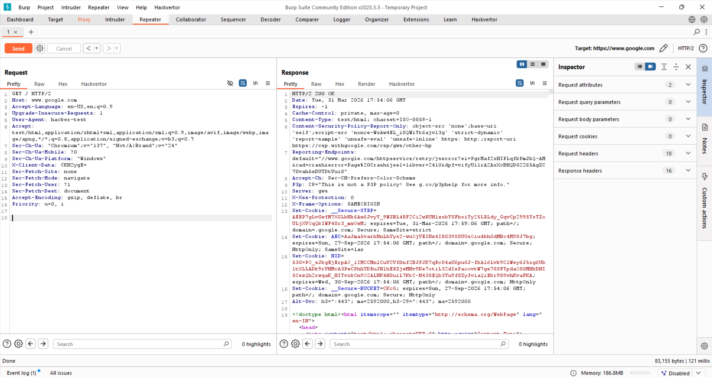
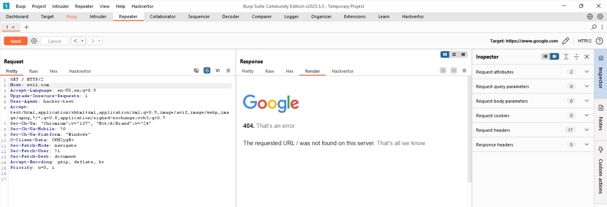

# 🔬 Day 2 – Request Analysis

## 📌 Overview

This document provides a technical breakdown of HTTP request manipulation performed using Burp Suite.
The goal was to understand how servers react to modified inputs and how different headers influence behavior.

---

## 🧪 Experiment 1: Baseline Request

### Request

* Method: GET
* Target: `https://www.google.com`
* Standard browser-generated headers

### Response

* Status: **200 OK**


### Analysis

* The request follows a valid structure expected by the server
* All required headers are present
* Server processes request successfully

---

## 🧪 Experiment 2: Custom Header Injection

### Modification

Added a custom header:

```
X-Day-2-Test: working
```

### Response

* Status: **400 Bad Request**



### Analysis

* The server rejected the request due to unexpected or malformed input
* Possible reasons:

  * Strict header validation rules
  * Internal parsing issues
  * Security filtering mechanisms
* Demonstrates that not all headers are safely accepted

---

## 🧪 Experiment 3: Request Resubmission

### Action

* Sent request again via Repeater after correcting the issue

### Response

* Status: **200 OK**



### Analysis

* Confirms the previous failure was caused by request modification
* Valid requests restore normal server behavior
* Highlights importance of request integrity

---

## 🧪 Experiment 4: User-Agent Manipulation

### Modification

```
User-Agent: hacker-test
```

### Response

* Status: **200 OK**



### Analysis

* Server does not strictly validate User-Agent
* Indicates:

  * Header is informational, not critical
  * Server does not enforce strict client identity checks
* Useful for:

  * Fingerprinting behavior
  * Evasion testing

---

## 🧪 Experiment 5: Header Removal

### Modification

Removed:

```
Sec-Fetch-Site
```

### Response

* Status: **200 OK**


### Analysis

* Header is optional for request processing
* Server does not rely on it for validation
* Indicates flexibility in request handling

---

## 🧪 Experiment 6: Host Header Manipulation

### Modification

```
Host: evil.com
```

### Response

* Status: **404 Not Found**



### Analysis

* Host header determines how the server routes the request
* Incorrect value leads to:

  * Misrouting
  * Invalid resource lookup
* Critical header in HTTP/1.1 and HTTP/2

---

## 🧠 Key Observations

* HTTP requests consist of:

  * Method
  * Path
  * Headers
* Headers are not equally important:

  * **Critical** → Host
  * **Flexible** → User-Agent
  * **Optional** → Sec-Fetch-Site
* Servers validate inputs differently depending on context
* Small changes can produce drastically different responses

---

## 🔐 Security Perspective

These experiments highlight how request manipulation can influence server behavior.

### Potential Implications

* **Custom Header Injection**

  * Can reveal validation weaknesses
  * May trigger unexpected server behavior

* **User-Agent Manipulation**

  * Used for bypassing filters
  * Can simulate different clients

* **Header Removal**

  * Helps identify which headers are actually enforced

* **Host Header Manipulation**

  * Important for:

    * Host header attacks
    * Cache poisoning
    * Password reset poisoning
    * Virtual host confusion

---

## 📚 What I Learned

* Servers do not blindly trust requests — they validate structure
* Some headers are critical for routing and must be correct
* Many headers are optional and can be modified freely
* Request manipulation is the foundation of web security testing
* Burp Suite Repeater allows controlled experimentation with server behavior

---

## 🚀 Conclusion

Understanding HTTP request structure and manipulation is a fundamental skill in web security.
This exercise demonstrated how small modifications can:

* Break requests
* Change responses
* Reveal server behavior

Mastering this is essential for:

* Bug bounty hunting
* Web application testing
* Exploit development

---
