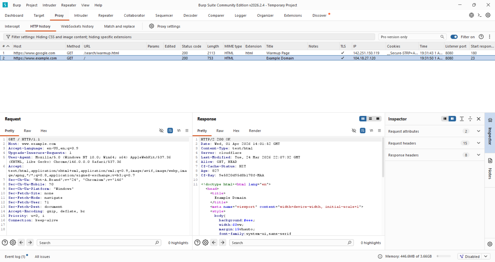
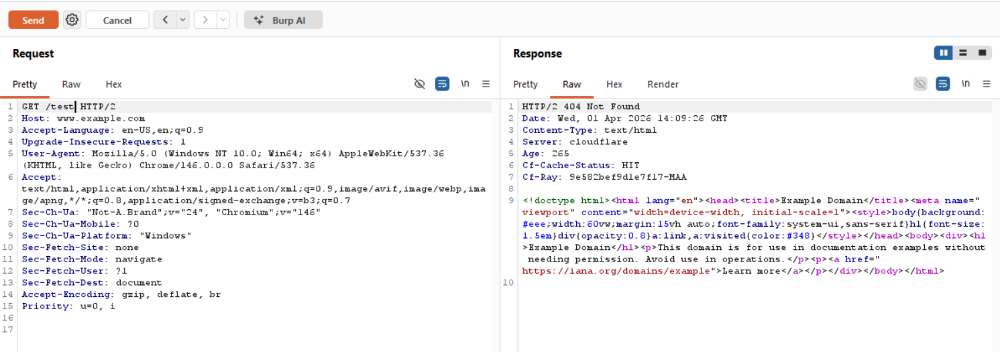
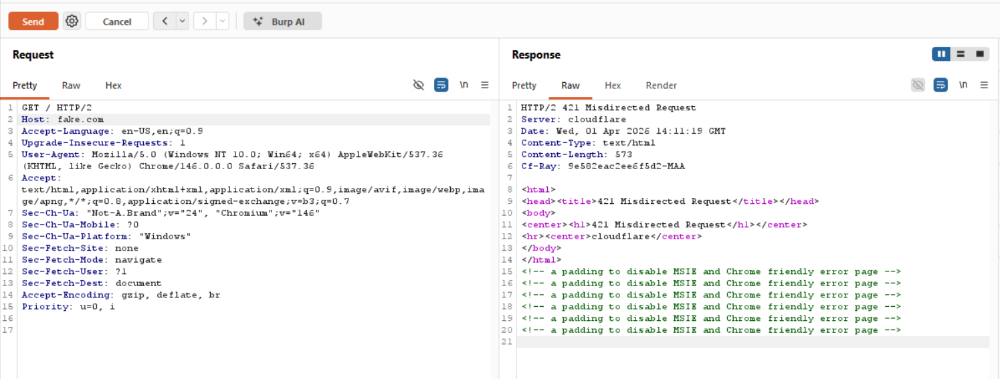

# 📅 Day 3 – Sending and Controlling HTTP Requests

## 🎯 Objective
Move from understanding HTTP requests to actively controlling and replaying them using Burp Suite Repeater.

---

## 🛠 Tools Used
- Burp Suite Community Edition
- Google Chrome

---

## 🔍 What I Did

### 1️⃣ Sent Base Request via Repeater
Captured a request and sent it manually using Repeater.

📸 Evidence:  

🔎 Result:
- Response: **200 OK**
- Successfully reproduced a normal browser request

---

### 2️⃣ Path Manipulation
Modified the request path:

GET /test HTTP/2

📸 Evidence:  

🔎 Result:
- Response: **404 Not Found**

---

### 3️⃣ Host Header Manipulation (Invalid Host)
Modified the Host header:

Host: fake.com

📸 Evidence:  

🔎 Result:
- Response: **421 Misdirected Request**

---

## 🧠 Key Learnings

- Repeater allows full control over HTTP requests
- Requests can be replayed without browser interaction
- The **Host header is critical** for correct routing
- Changing the **path directly impacts resource access**
- Servers strictly validate request structure

---

## 🔁 What Changed from Day 2

- Shift from observing → actively controlling requests
- Faster testing using Repeater
- Immediate feedback loop (modify → send → analyze)
- No dependency on browser behavior

---

## 🚀 Summary

Day 3 focused on taking control of HTTP requests and understanding how servers respond to direct manipulation. This is a foundational step toward real-world web security testing and vulnerability discovery.
