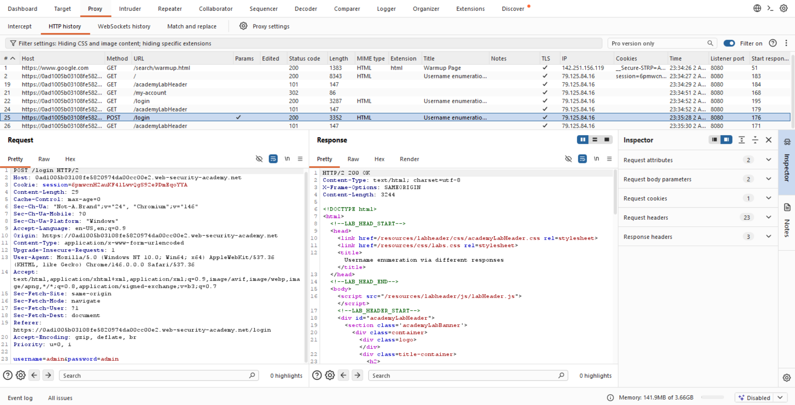
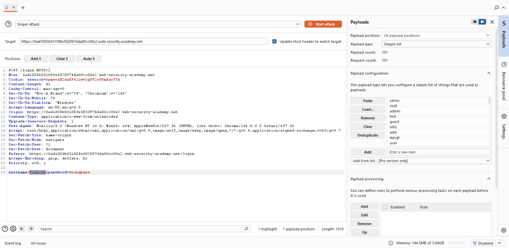
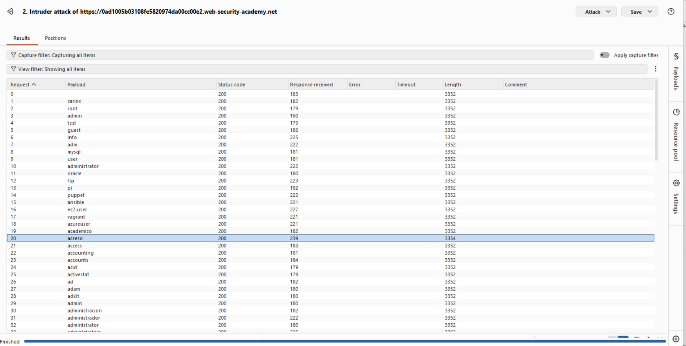
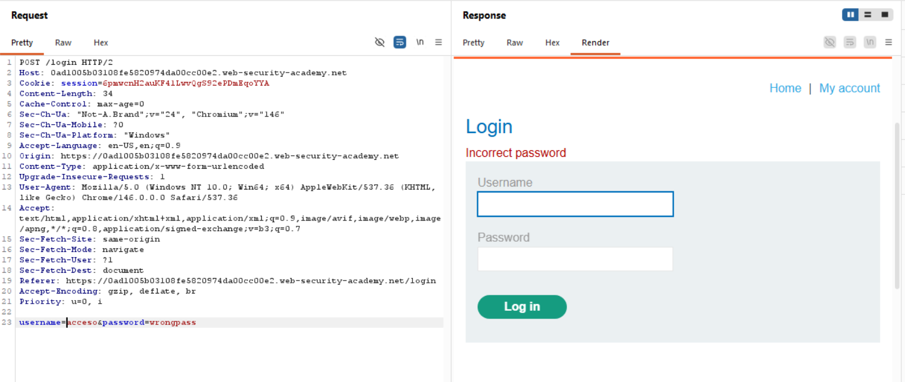
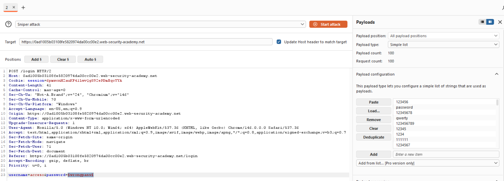
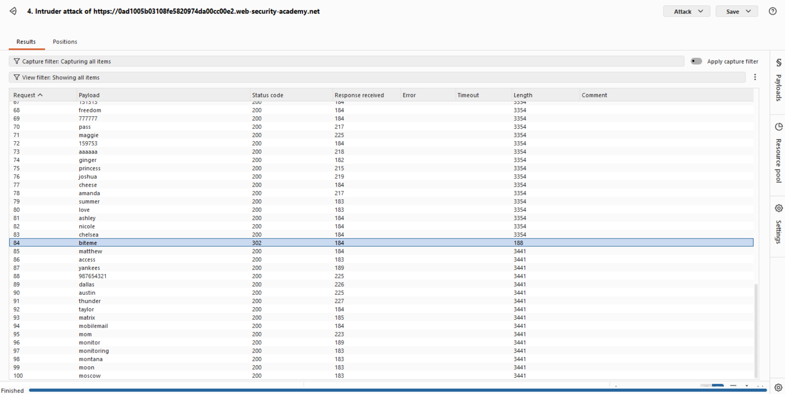
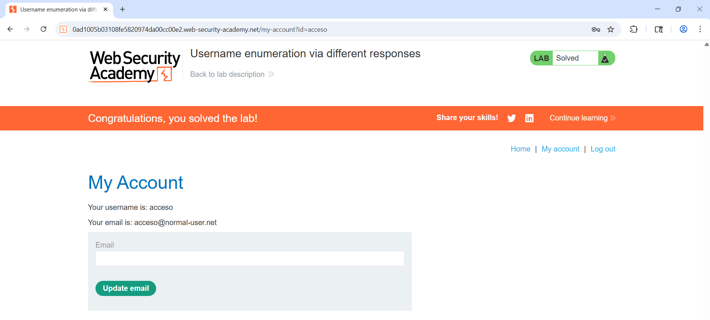

# Day 4 — Request Replay & Authentication Attack Analysis

---

## Objective
Replay a real login request and exploit authentication logic by analyzing server responses.

---

## Target
Web Security Academy Lab  
Vulnerability: Username Enumeration via Response Differences

---

## Step 1 — Capture Login Request

A login request was intercepted using Burp Proxy.

### Request
POST /login  
username=admin&password=admin  

### Observations
- Credentials sent in request body  
- Session cookie present  
- Standard headers included  

---

## Step 2 — Username Enumeration Setup

The request was sent to Intruder.

### Configuration
- Attack type: Sniper  
- Payload position: username  
- Password kept constant  

---

## Step 3 — Response Analysis

Multiple usernames were tested.

### Observation
- Most responses: "Invalid username"  
- One response differed  

---

## Step 4 — Valid Username Identified

A different response was observed:

Incorrect password

### Finding
username = acceso  

---

## Step 5 — Password Attack Setup

Second Intruder attack performed.

### Configuration
- Username fixed: acceso  
- Payload position: password  

---

## Step 6 — Successful Authentication Signal

A key response was identified:

HTTP 302 Found  
Location: /my-account?id=acceso  

### Interpretation
- 200 OK → failed login  
- 302 Found → successful login  

---

## Step 7 — Account Access

Using valid credentials, access to the account page was obtained.

### Result
- Authenticated as user: acceso  
- Dashboard loaded successfully  

---

## Security Analysis

### Vulnerability
Username Enumeration

### Root Cause
Different error messages:
- Invalid username  
- Incorrect password  

### Impact
- Valid usernames can be identified  
- Enables targeted brute-force attacks  

---

## Conclusion

Attack flow:

Capture → Replay → Enumerate → Brute-force → Access  

Authentication was successfully bypassed by analyzing response differences.
