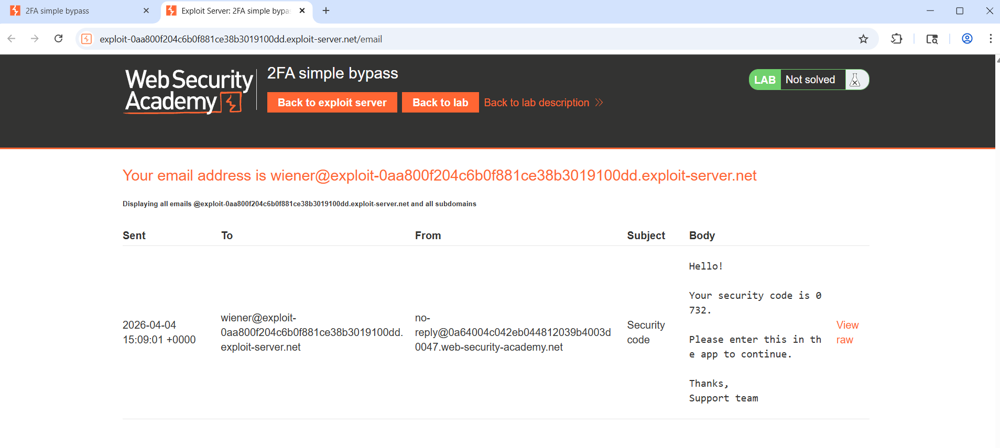
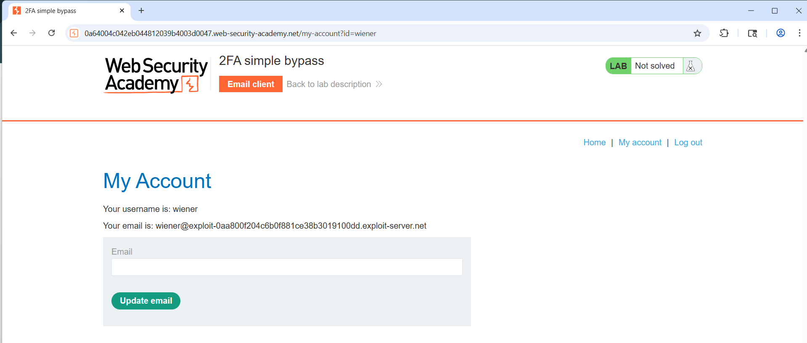
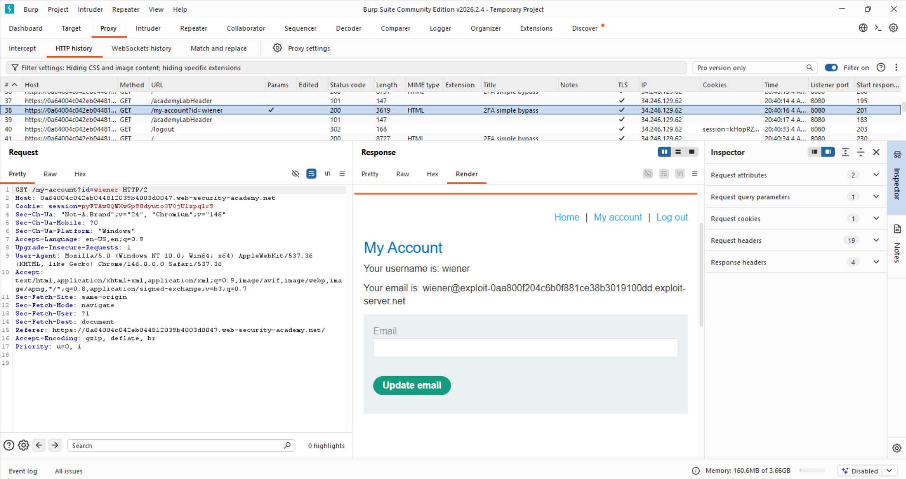
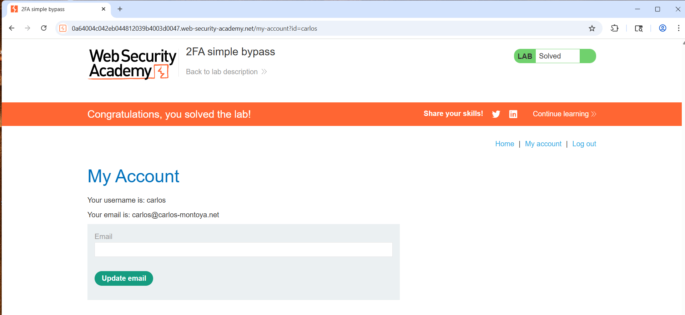

# 📄 Day 5 — Request Replay & 2FA Bypass Analysis

---

## 🎯 Objective
Exploit a flawed 2FA implementation to access another user's account (**carlos**) without possessing their verification code.

---

## 🧠 Core Concept

This lab demonstrates a flaw where:
- Session is created before full authentication is complete
- 2FA is not enforced on protected endpoints
- Authorization is not properly validated

➡️ Result: Unauthorized account access

---

## 🧪 Attack Flow

Login (wiener) → 2FA step → Session active  
→ Skip enforcement → Modify request  
→ Access `/my-account?id=carlos`

---

## 📸 Step 1 — 2FA Code Delivery

### Observation
- A verification code is sent via email
- Intended as second authentication step

### Insight
- 2FA exists but is not strictly enforced

---

## 📸 Step 2 — Authenticated Session (Browser)

### Observation
- Logged in as `wiener`
- Session is active
- Access to `/my-account?id=wiener`

### Insight
- Session is usable before full authentication is complete

---

## 📸 Step 3 — Session Observed in Burp Suite

### Request

GET /my-account?id=wiener HTTP/2
Cookie: session=XYZ...

### Insight
- Application trusts:
  - Session cookie
  - `id` parameter
- No validation between them

---

## 📸 Step 4 — Exploit (Parameter Manipulation)

### Modified Request

GET /my-account?id=carlos HTTP/2
Cookie: session=XYZ...

### Result
- Access to Carlos’s account
- No 2FA verification required

---

## 🚨 Vulnerabilities Identified

### 1. Improper 2FA Enforcement
- 2FA step is not required to access protected resources

### 2. Broken Access Control
- Application does not verify user ownership of requested resource

### 3. IDOR (Insecure Direct Object Reference)
- Direct access via:

/my-account?id=carlos

---

## 🔐 Why the Attack Works

- Session is created before full authentication
- Session is not tied to verified identity
- Server trusts user-controlled input (`id`)
- No authorization checks are performed

---

## 🧠 Key Learnings

- Authentication ≠ Authorization  
- 2FA must be enforced at all access points  
- Never trust user-controlled identifiers  
- Session must be bound to verified user identity  

---

## 🛡 Mitigation

- Enforce 2FA completion before granting access  
- Remove reliance on `id` parameter for identity  
- Implement server-side authorization checks  
- Bind session to authenticated user  

---

## 📌 Conclusion

A complete authentication bypass was achieved by:
- Ignoring 2FA enforcement
- Manipulating request parameters

➡️ Result: Unauthorized access to another user’s account

---

## ✅ Final Result

- Accessed **Carlos’s account**
- Bypassed 2FA completely
- Demonstrated broken authentication and access control
